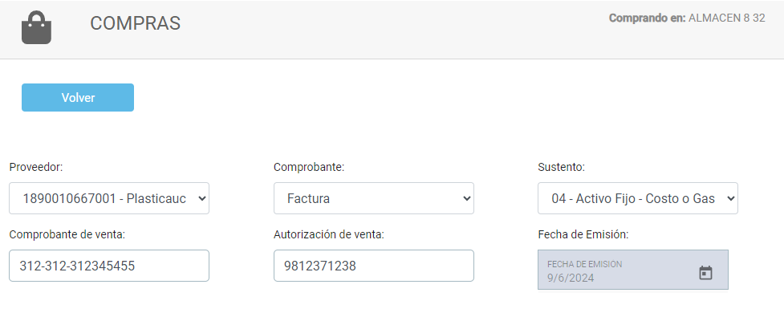
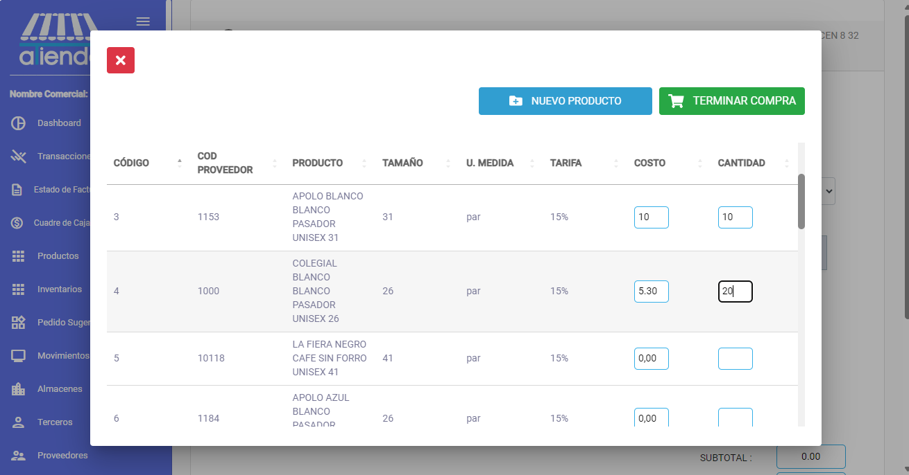
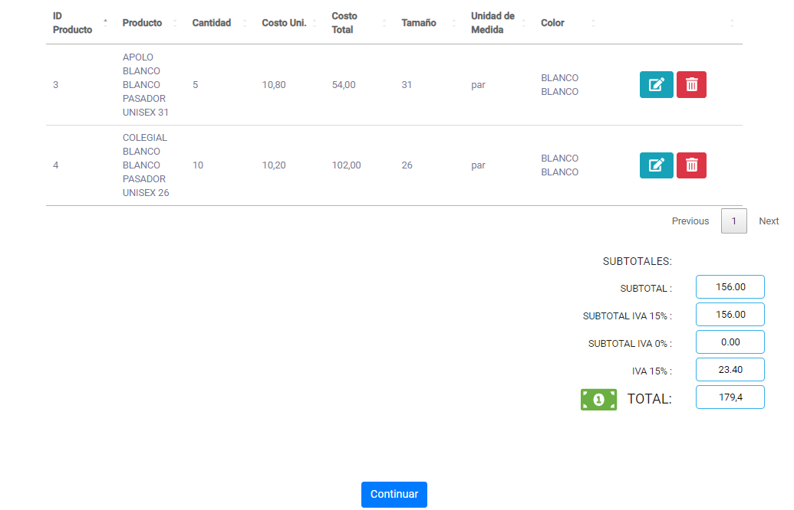
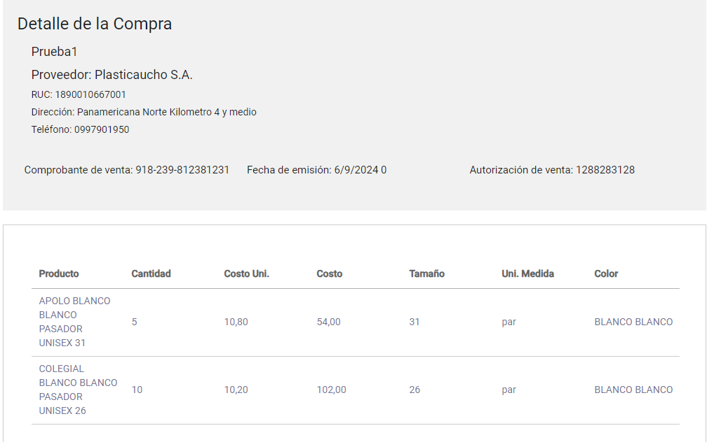
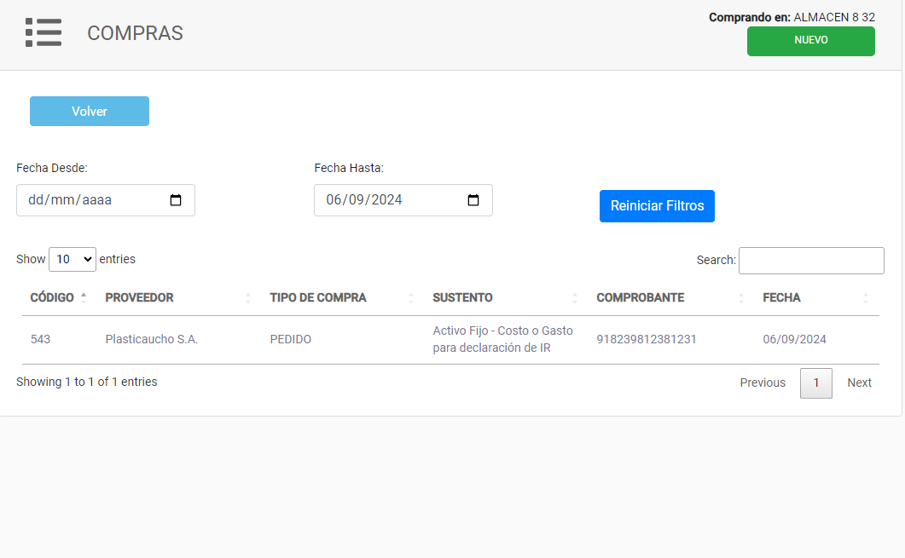

import { Callout } from 'nextra/components'
import React from 'react'
import Image from 'next/image'

# **COMPRAS**

Este módulo le ofrece la posibilidad de gestionar las compras de productos. Puede agregar nuevas compras, actualizar información y consultar el estado de cada una.

<Callout type="info" >
  Al realizar una compra se consigue registrar en el inventario los productos comprados y se podra visualizar en el modulo de inventario. Posterior a esto se podra realizar ventas de los productos comprados.
</Callout>

## Existen dos opciones para crear una compra:

### 1. Crear una nueva compra
**Crear una compra***
Para crear una compra se debe seguir los siguientes pasos:

1. **Seleccionar el almacen en el que se realizará la compra**: Seleccionar el almacen en el que se realizará la compra.

2. **Selecciona el boton de nuevo**: Seleccionar el boton de nuevo para crear una nueva compra. El boton se encuentra en la parte superior derecha de la pantalla, es un boton verde con el texto "NUEVO".

3. **Seleccionar el proveedor de los productos**: Seleccionar el proveedor de los productos que se desean comprar.

4. **Seleccionar los demas datos de la compra**: Seleccionar los demas datos de la compra:
    
        - **Comprobante**: Seleccionar el comprobante de la compra.

        - **Sustento**: Seleccionar el sustento de la compra.

        - **Numero de comprobante**: Ingresar el numero de comprobante de la compra.

        - **Autorizacion de la compra**: Ingresar la autorizacion de la compra. 10 digitos si es impreso y 49 digitos si es electronico.

3. **Agregar productos a la compra**: Agregar los productos que se desean comprar a la lista de productos de la compra.

<Callout type="info" >
Para agregar un producto a la compra se debe ingresar el costo de compro y la cantidad. Presione ENTER o TERMINAR COMPRA para guardar el producto en la compra.
</Callout>

### 2. Subir XML para crear una compra masiva
**Subir XML para crear una compra masiva**

Para subir un XML y crear una compra masiva se debe seguir los siguientes pasos:

1. **Seleccionar el boton de subir XML**: Seleccionar el boton de subir XML para subir el archivo XML de la compra masiva.

2. **Seleccionar el archivo XML**: Seleccionar el archivo XML de la compra masiva que se desea subir.

3. **Esperar a que se carguen los productos**: Esperar a que se carguen los productos del XML y luego seleccionar el boton de guardar para guardar la compra masiva.

4. **Revisar los detalles de la compra**: Revisar los detalles de la compra y seleccionar el boton de guardar para guardar la compra.

<Callout type="warning" emoji="⚠️">
El XML debe ser proporcionado por el proveedor de los productos y debe cumplir con que sea un XML valido ademas de ser facturado con el RUC de su empresa.
</Callout>

## Verificar la informacion de la compra

Las dos opciones de compra permiten verificar la informacion de la compra antes de guardarla. Se puede verificar los productos, el total de la compra y los datos de la compra.

Al confirmar la compra, se guardará la compra y se podrá visualizar un detalle de la misma. Se podrá ver los productos comprados, el total de la compra y los datos de la compra.

Finalmente, se finalizara la compra y se podra visualizar la compra en la lista de compras realizadas.

<Callout type="info" >
  Al realizar una compra se consigue registrar en el inventario los productos comprados y se podra visualizar en el modulo de inventario. Posterior a esto se podra realizar ventas de los productos comprados.
</Callout>
