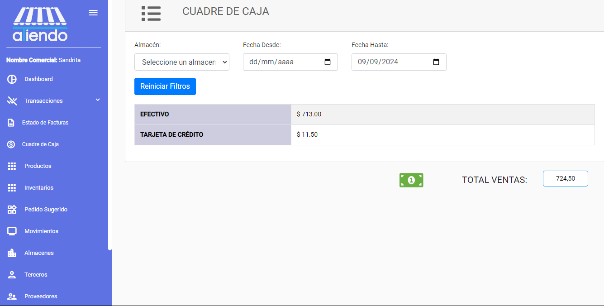
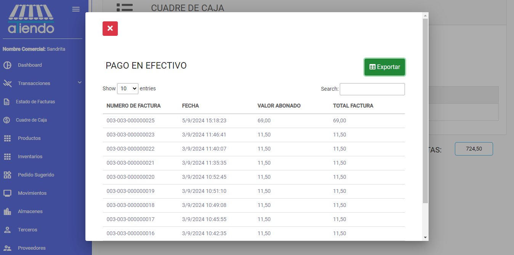

import { Callout } from 'nextra/components'

# **CUADRE DE CAJA**

El cuadre de caja es una herramienta que permite a los usuarios verificar que el dinero que se encuentra en la caja coincide con el saldo que debería haber. Es una forma de asegurarse de que no hay errores en los registros de las ventas y los pagos realizados.

## Pasos para realizar un cuadre de caja:

### 1. Ingresar a la sección de cuadre de caja

Para realizar un cuadre de caja, se debe ingresar a la sección de cuadre de caja. Para ello, se debe seleccionar el menú de cuadre de caja ubicado en la parte superior derecha de la pantalla.

### 2. Seleccionar la caja a cuadrar y la fecha

Una vez dentro de la sección de cuadre de caja, se debe seleccionar la caja que se desea cuadrar y la fecha en la que se realizará el cuadre. Es importante tener en cuenta que el cuadre de caja se realiza por caja y por fecha.

<Callout type="info">
    Se muestra el cuadre de las formas de pago que acepta la empresa y el valor total de las ventas realizadas en la fecha seleccionada.
</Callout>

Para obtener un detalle de cada forma de pago, se debe presionar en el valor del detalle. Se desplegará un cuadro con el detalle de las ventas realizadas con esa forma de pago.

