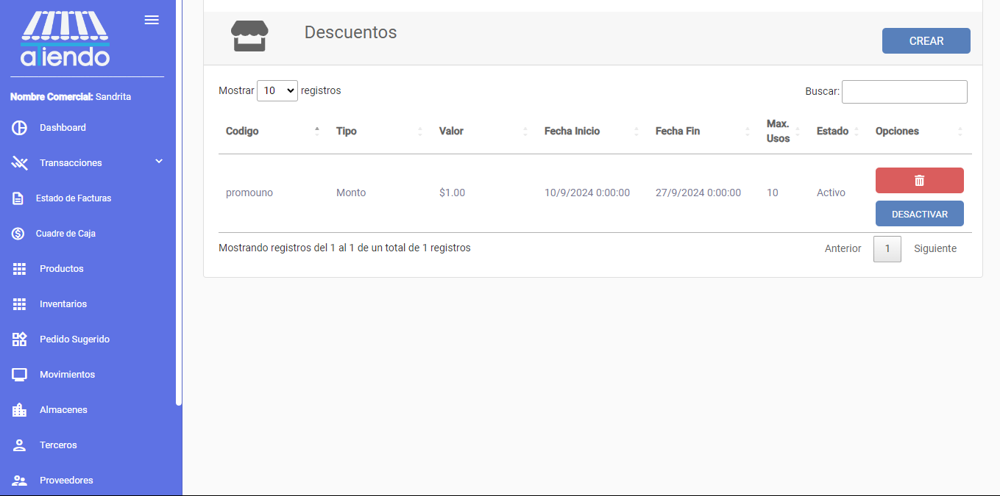
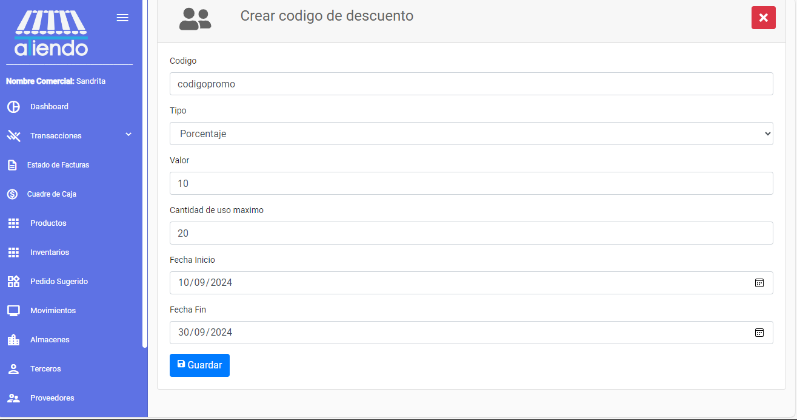
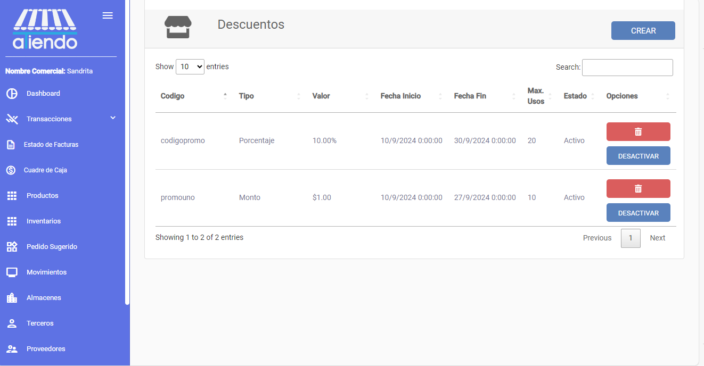

import { Callout } from 'nextra/components'

# **DESCUENTOS**

Este módulo le permite crear, editar y eliminar descuentos. Se pueden crear descuentos por porcentaje o por monto fijo. Además, se pueden aplicar descuentos a productos con el uso de un código de descuento.

## Crear descuentos

Para crear un descuento, se debe ingresar el código del descuento, el tipo de descuento (porcentaje o monto fijo), el valor del descuento, el número de usos del código y la fecha de expiración del código. 

## Eliminar o desactivar descuentos

Para eliminar o desactivar un descuento, se debe seleccionar el descuento y hacer clic en el botón de eliminar o desactivar. Si se desactiva un descuento, este no se podrá utilizar en la tienda.

