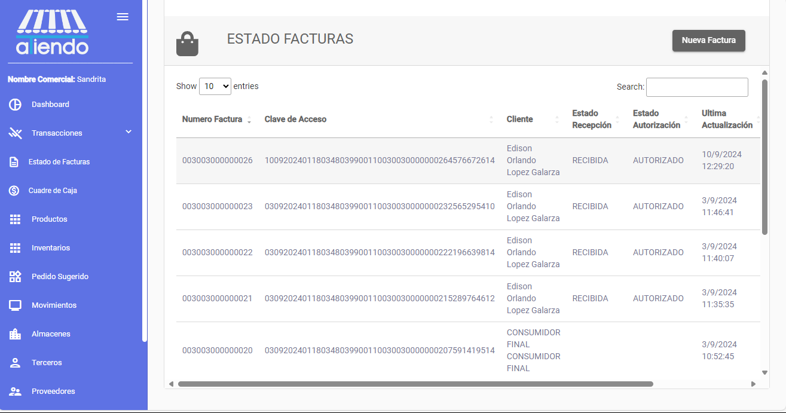
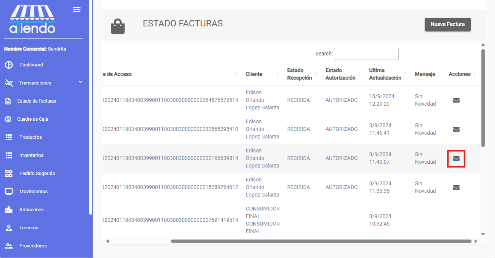
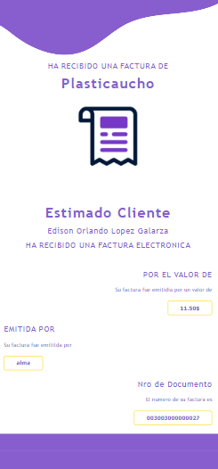
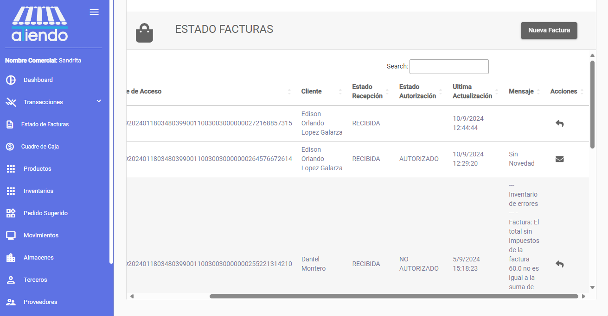

import { Callout } from 'nextra/components'

# **ESTADO DE FACTURAS**

Este módulo le permite visualizar el estado de las facturas de la tienda. Se visualizará todas las facturas realizadas, cada uno tendra:

- El número de factura
- Clave de acceso
- Cliente
- Fecha de la factura
- Estado de recepción
- Estado de autorización
- Ultima actualización
- Mensaje de respuesta
- Acciones entre las cuales se puede enviar la factura por correo electrónico y volver a enviar para la autorización.

## Enviar factura por correo electrónico

Una vez que el estado de recepción y autorización de la factura esté en estado "Recibido" y "Autorizado" respectivamente, se podrá enviar la factura por correo electrónico al cliente. Para enviar la factura, se debe seleccionar la factura y hacer clic en el botón con el ícono de correo.

Cuando se haga clic en el botón de enviar factura, se enviara la factura al correo electrónico del cliente.

La factura se enviará de la siguiente manera:

Además, se adjuntará la factura en formato PDF y XML.

## Volver a enviar factura para autorización

Si la factura no ha sido autorizada, se podrá volver a enviar la factura para la autorización. Para volver a enviar la factura, se debe seleccionar la factura y hacer clic en el botón con el ícono de flecha.

