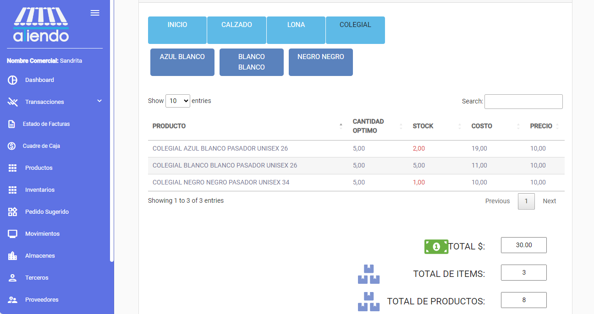

import { Callout } from 'nextra/components'

# **INVENTARIOS**

Este módulo le ofrece la posibilidad de visualizar el inventario de productos. Se visualizará el total del costo del inventario, el total de productos en el inventario y el total de ítems en el inventario. Además, se puede exportar el inventario a un archivo de Excel, como en la mayoría de los módulos.

## Filtros por categoría

Se puede filtrar el inventario por categoría y subcategoría. El cálculo del costo total del inventario se realiza en base a los productos que se visualizan en la tabla.

##  Pedido sugerido

Además, desde el inventario se puede navegar hasta el modulo de pedido sugerido, para realizar un pedido de productos que se encuentran en el inventario y tiene un stock mínimo.

Se mostrará una tabla con los productos que tienen un stock mínimo y se podrá realizar un pedido de los productos seleccionados.

Finalmente, se podrá visualizar el pedido sugerido en un excel en conjunto con los productos con stock mínimo y la cantidad a pedir.

