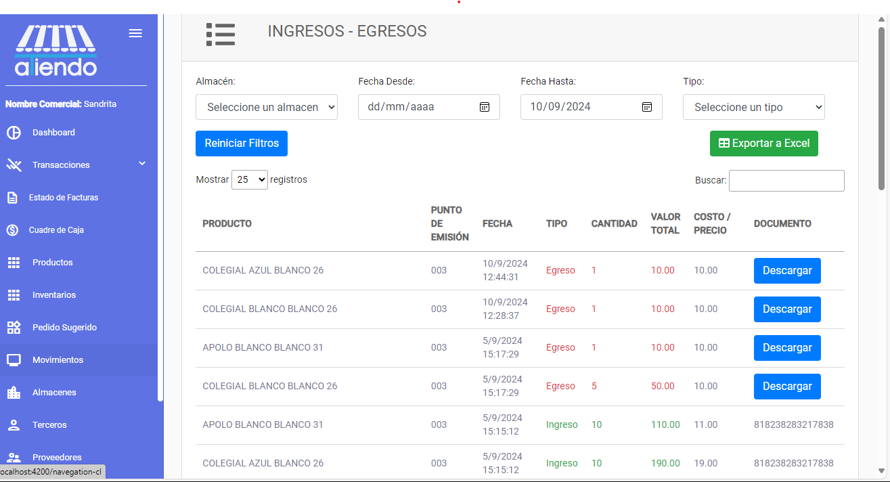

import { Callout } from 'nextra/components'

# **Ingresos y Egresos**

Este módulo le permite visualizar los ingresos y egresos de sus tiendas. Podra visualizar lo siguiente:

- Producto
- Punto de emisión
- Fecha
- Tipo de movimiento
- Cantidad
- Valor Total
- Costo / Precio
- Documento (Si es una factura electrónica se podra visualizar el documento, si es una compra se podra visualizar el numero de comprobante)

El módulo de ingresos y egresos cuenta con diferentes opciones para filtrar los movimientos. 

### Exportar movimientos

Se puede exportar los movimientos a un archivo de Excel. Para exportar los movimientos, se debe hacer clic en el botón de exportar.