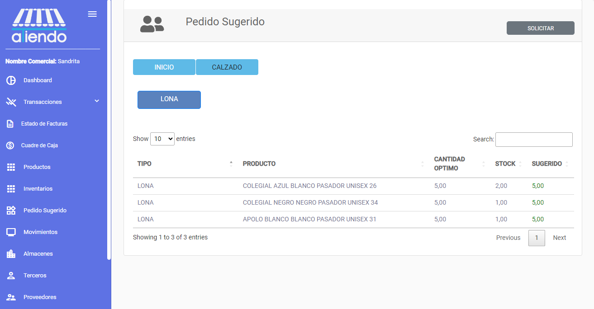

import { Callout } from 'nextra/components'

# **PEDIDO SUGERIDO**

Este módulo le permite visualizar los productos que tienen un stock mínimo y realizar un pedido de los productos seleccionados. Se mostrarán los siguientes campos:

Se mostrará una tabla con los productos que tienen un stock mínimo y se podrá realizar un pedido de los productos seleccionados.

Finalmente, se podrá visualizar el pedido sugerido en un archivo Excel, junto con los productos con stock mínimo y la cantidad a pedir.
