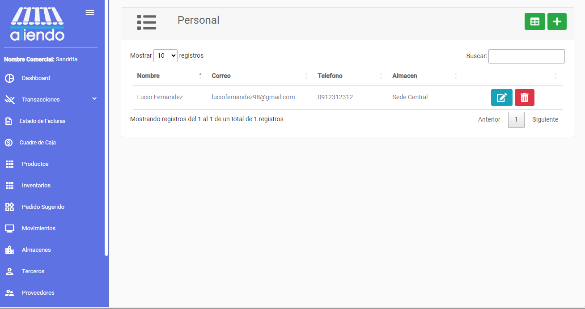
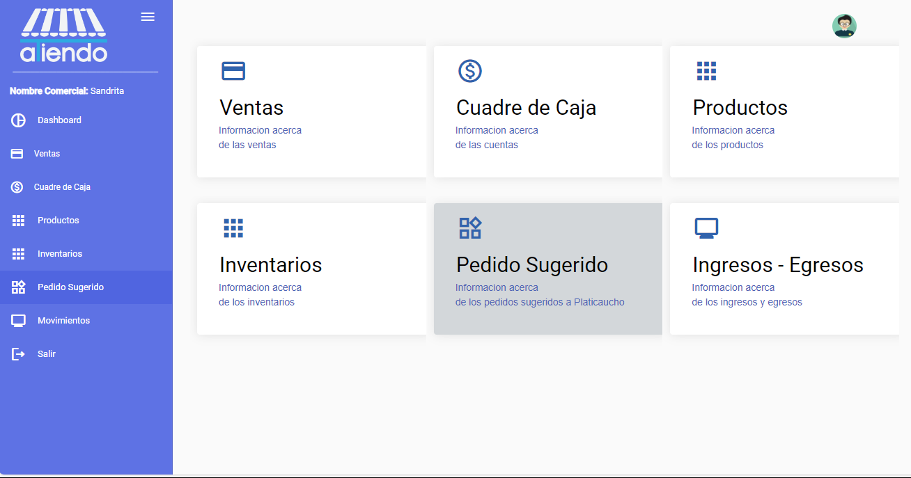

# **PERSONAL**

Este módulo le permite visualizar el personal o empleados de sus tiendas. Los empleados son las personas que trabajan en la tienda y tienen acceso a ciertas funcionalidades del sistema.

Se visualizarán todos los empleados, cada uno con la siguiente información:

- Nombre
- Correo Electrónico
- Teléfono
- Almacén

## Editar empleado

Para editar un empleado, se debe seleccionar al empleado y hacer clic en el botón con el ícono de lápiz. Se abrirá un formulario con la información del empleado, la cual se podrá editar.

## Eliminar empleado

Para eliminar un empleado, se debe seleccionar al empleado y hacer clic en el botón con el ícono de papelera. Una vez confirmada la eliminación, el empleado se eliminará de la lista de empleados.

## Crear empleado

Para crear un empleado, se debe hacer clic en el botón con el ícono de más. Se abrirá un formulario con los campos a llenar para crear un nuevo empleado.

## Acceder como empleado

Para acceder como empleado, se debe solicitar a su administrador que le proporcione un usuario y una contraseña. Una vez que tenga un usuario y una contraseña, podrá acceder al sistema con las funcionalidades asignadas a su rol, visualizando una interfaz similar a la siguiente:

