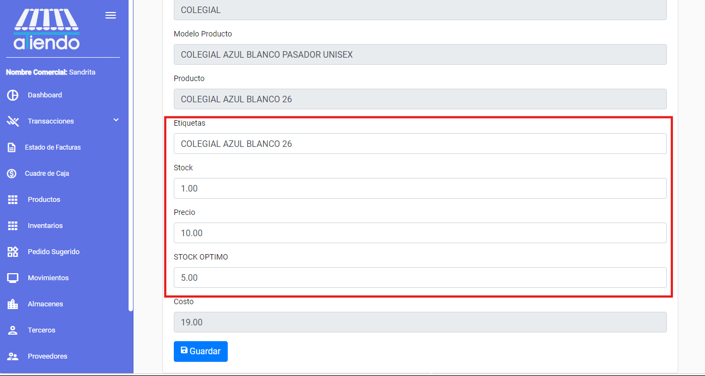

import { Callout } from 'nextra/components'

# **PRODUCTOS**

Este módulo le permite visualizar los productos de la tienda. Se mostrarán todos los productos, cada uno con la siguiente información:

- Imagen del producto
- Categoría
- Tipo
- Marca
- Modelo
- Color
- Características
- Género
- Etiquetas
- Stock
- FAV
- Precio
- Costo
- Tamaño
- Unidad de medida
- IVA
- ICE
- Acciones, entre las cuales se puede editar y eliminar el producto.

## Editar producto

Para editar un producto, se debe seleccionar el producto y hacer clic en el botón con el ícono de lápiz. Se abrirá un formulario con la información del producto, la cual se podrá editar.

<Callout type="info">
El stock y el stock sugerido de los productos son campos diferentes. El stock es el stock actual del producto en el inventario, mientras que el stock sugerido es el stock mínimo que se debe tener en el inventario para que el producto no se agote.
</Callout>

<Callout type="warning" icon="💡">
En esta sección se podrá editar el stock sugerido de cada producto. El stock sugerido es el stock mínimo que se debe tener en el inventario para que el producto no se agote.
</Callout>

<Callout type="error">
No se recomienda modificar el STOCK de los productos a menos que sea necesario. Si se modifica el stock de un producto, se actualizará el stock en el inventario, lo cual podría desencadenar problemas en la gestión del inventario.
</Callout>

## Eliminar producto

Para eliminar un producto, se debe seleccionar el producto y hacer clic en el botón con el ícono de papelera. Una vez confirmada la eliminación, el producto se eliminará de la lista de productos.
