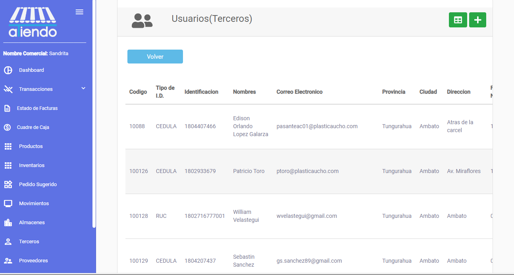

# **TERCEROS**

En este módulo se podrán visualizar los terceros de la tienda. Se visualizarán todos los terceros, cada uno tendrá la siguiente información:

- Código
- Tipo de Identificación
- Identificación
- Nombre
- Correo Electrónico
- Provincia
- Ciudad
- Dirección
- Fecha de Nacimiento
- Teléfono
-Acciones entre las cuales se puede editar y eliminar el tercero.

## Editar tercero

Para editar un tercero, se debe seleccionar el tercero y hacer clic en el botón con el ícono de lápiz. Se abrirá un formulario con la información del tercero, la cual se podrá editar.

## Eliminar tercero

Para eliminar un tercero, se debe seleccionar el tercero y hacer clic en el botón con el ícono de basura. Una vez confirmada la eliminación, el tercero se eliminará de la lista de terceros.