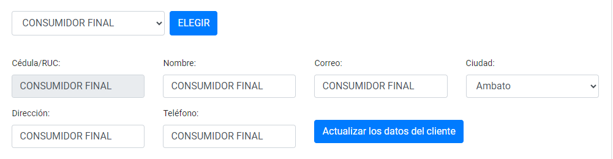
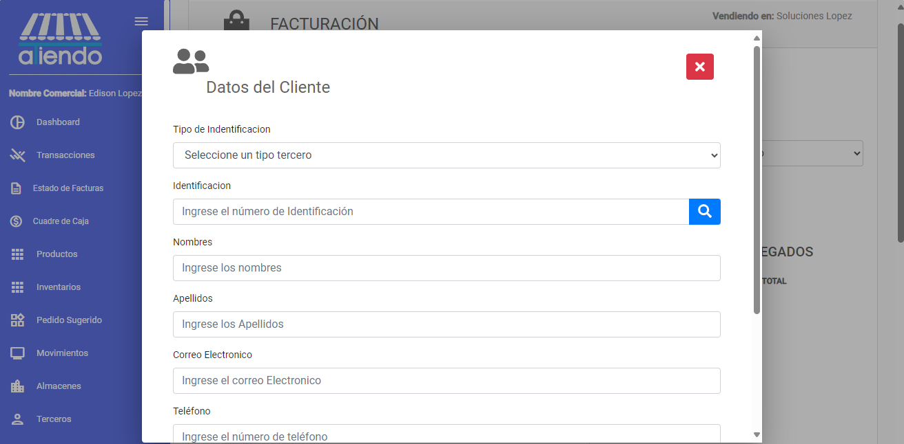
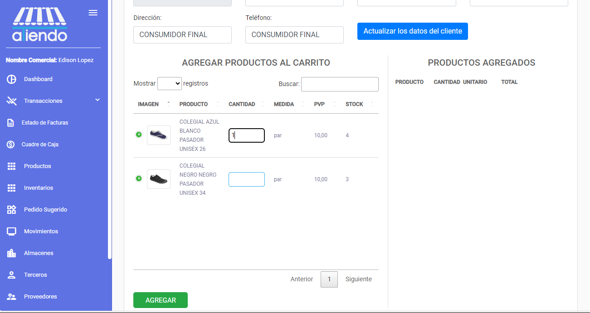
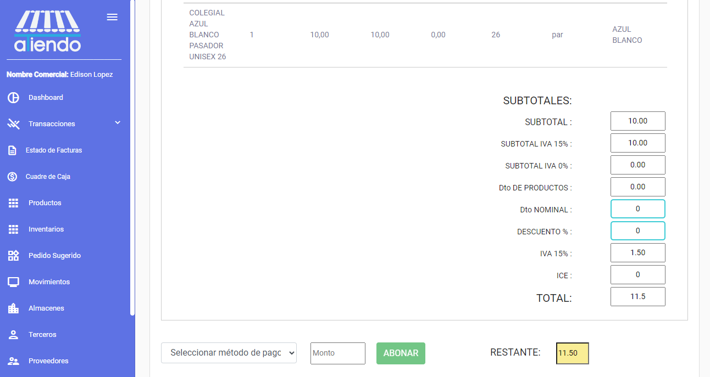
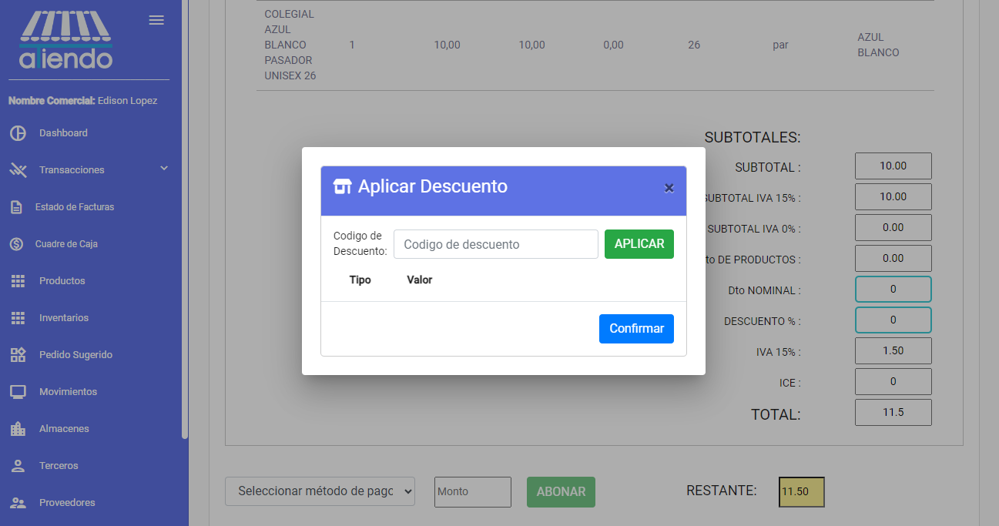
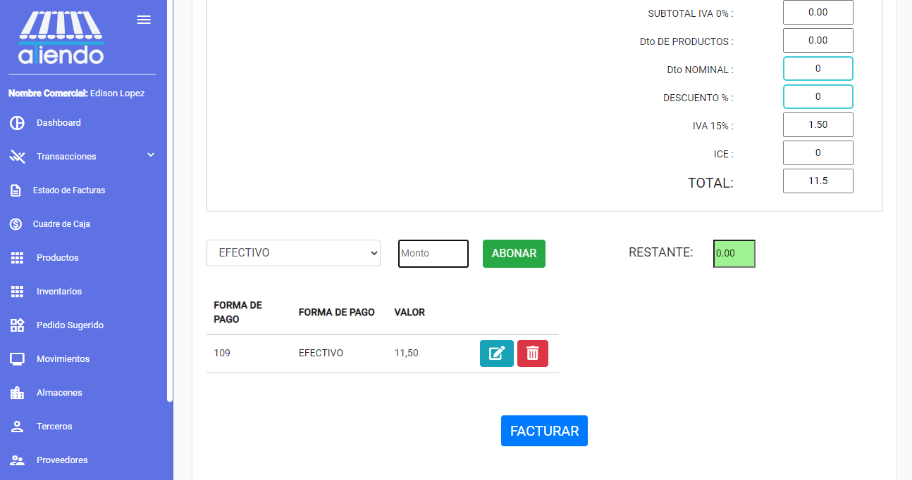
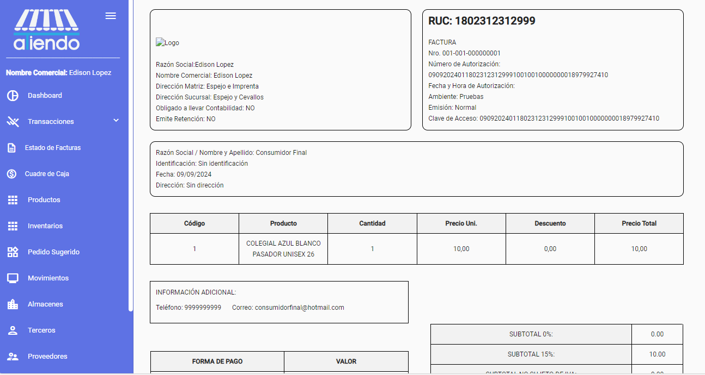

import { Callout } from 'nextra/components'
import React from 'react'
import Image from 'next/image'

# **VENTAS**

Este módulo le ofrece la posibilidad de gestionar las ventas de productos. Puede agregar nuevas ventas, actualizar información y consultar el estado de cada una.

<Callout type="info">
    Al realizar una venta se registra en el inventario, en los movimientos y en otros módulos que se verán afectados por la venta. Posteriormente, se podrá visualizar en el módulo de ventas.
</Callout>

## Existen dos opciones para realizar una venta:

### 1. Crear una venta con una factura electrónica

Para crear una venta con factura electrónica, se deben seguir los siguientes pasos:

1. **Seleccionar el almacén en el que se realizará la venta**: Seleccionar el almacén en el que se realizará la venta.

2. **Seleccionar el botón de nuevo**: Seleccionar el botón de nuevo para crear una nueva venta. El botón se encuentra en la parte superior derecha de la pantalla, es un botón verde con el texto "NUEVO".

3. **Seleccionar el cliente de la venta**:

Se puede generar una factura electrónica con los datos de un cliente registrado o como consumidor final.

##### Consumidor Final:

Todos los datos serán generados automáticamente.

##### Factura con Cliente:

Se mostrará un formulario para ingresar los datos del cliente.

Si el cliente ya está registrado en cualquiera de sus almacenes, se puede buscar el cliente ingresando su identificación y presionando el botón de `Buscar` (ícono de lupa). Los datos se cargarán automáticamente.

En caso de que el cliente no esté registrado, se deberán ingresar los datos manualmente.

4. **Adición de Productos a la Factura**

Después de seleccionar el tipo de cliente, puedes añadir productos a la factura. Para cada producto, ingresa la cantidad que deseas añadir a la compra y presiona `Enter` o el botón de `Añadir` para agregar el producto a la lista de productos de la factura.

<Callout type="info">
Para optimizar el tiempo en agregar al carrito, una vez insertada la cantidad a vender, se recomienda presionar la tecla `Enter` para que el producto se añada a la lista de productos de la factura.
</Callout>

5. **Finalizar la Venta**

Después de agregar todos los productos, se mostrará un resumen de la venta. En esta pantalla, podrás ver los productos añadidos, el total de la venta y los datos del cliente. También tendrás la opción de aplicar descuentos, ya sea por porcentaje o por monto, simplemente ingresando el código de descuento.

***Agregar Descuento (Opcional)***

Para aplicar un descuento, selecciona el botón en el recuadro de descuento. En la pantalla se desplegará un formulario para ingresar el código de descuento.

### 2. Crear una venta con una factura manual

**Crear una venta con factura manual**

6. **Agregar los medios de pago**

Seleccionar los medios de pago con los que se realizará la venta. Se puede seleccionar varios medios de pago y se debe ingresar el monto de cada medio de pago hasta completar el total de la venta.

Termina la venta y podrás visualizar la factura electrónica. Puedes generar el PDF o enviarla por correo.

