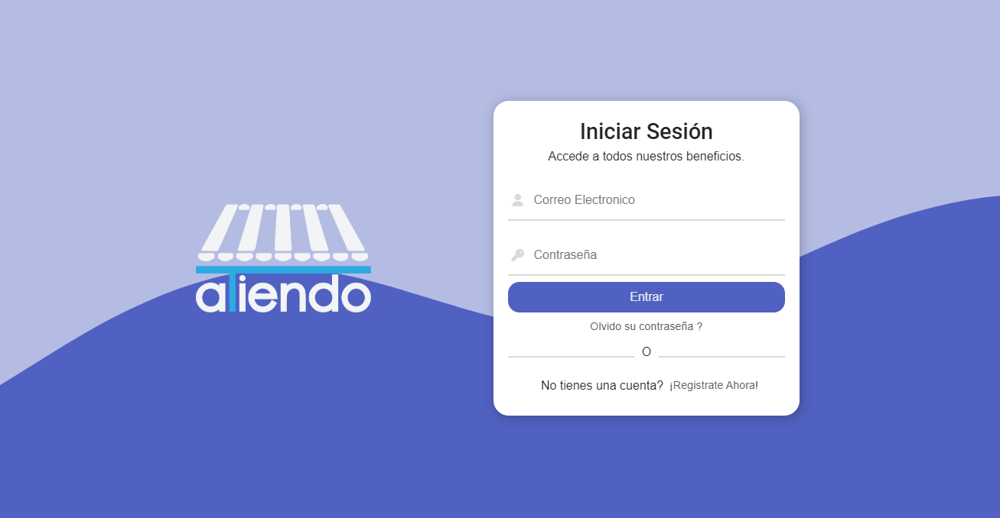
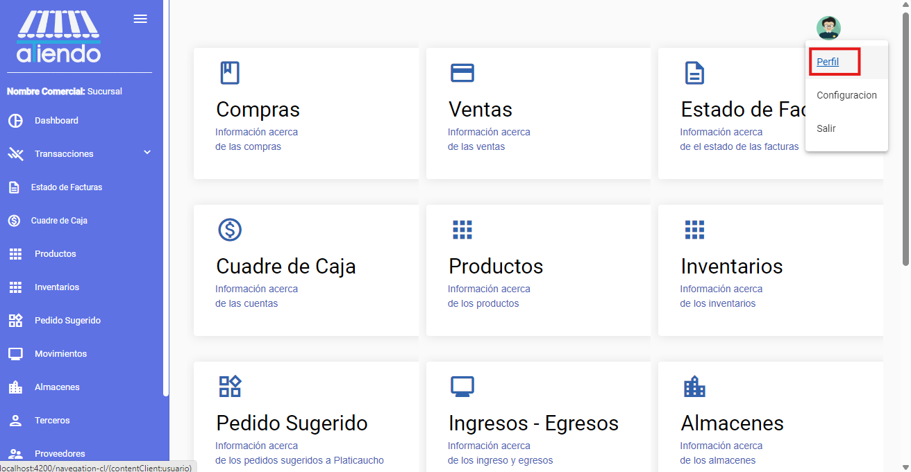
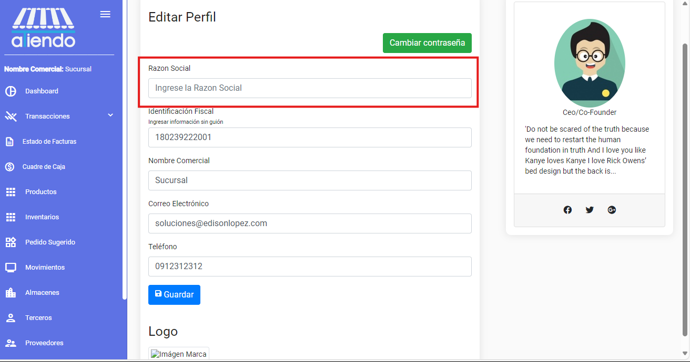
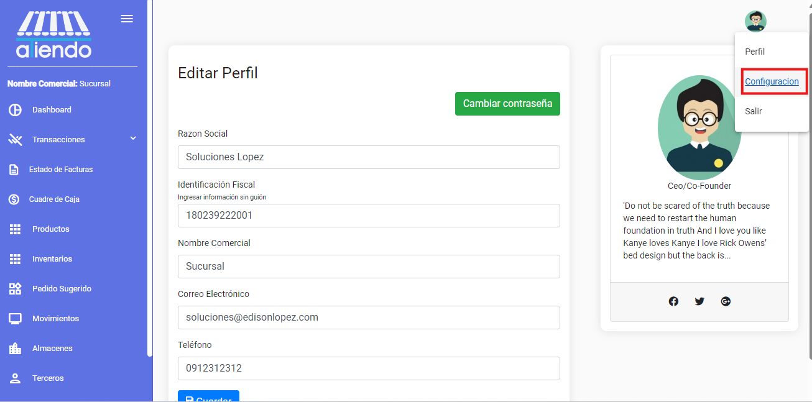
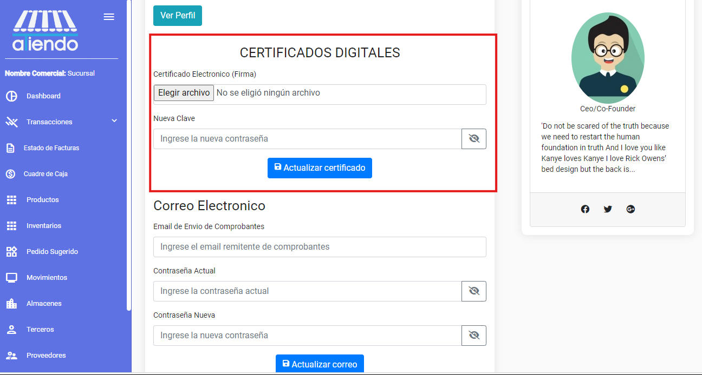
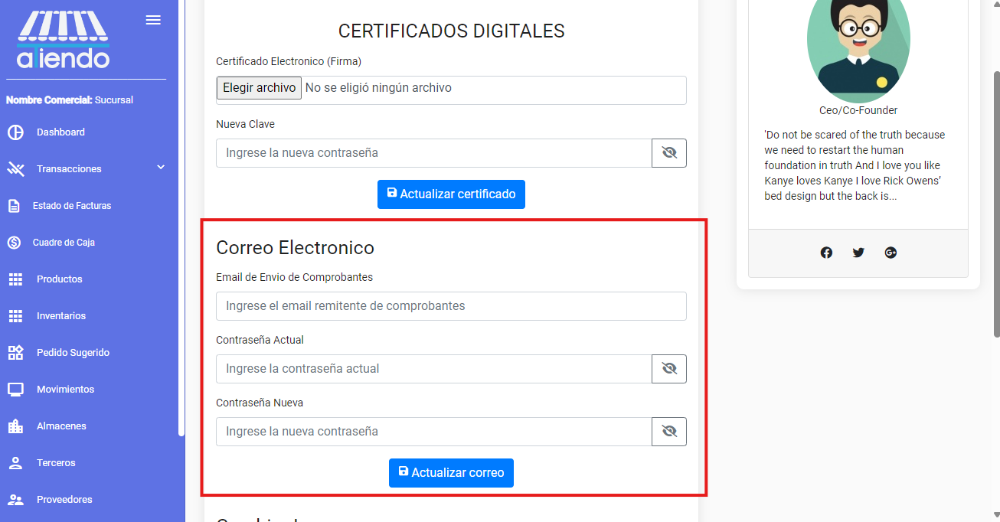
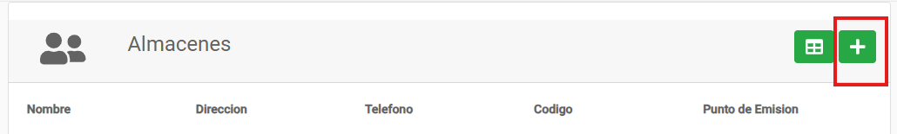
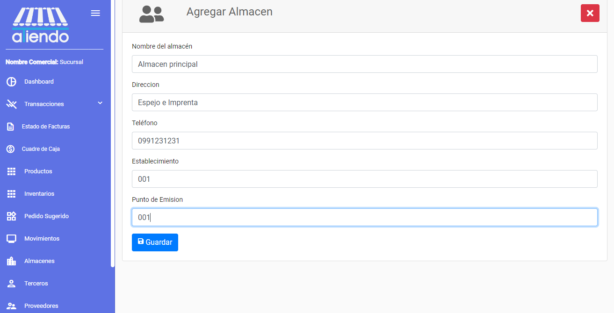

import { Steps } from 'nextra/components'
import { Callout } from 'nextra/components'

# **CONFIGURACIÓN INICIAL**

Para iniciar a utilizar el sistema, es necesario configurar los datos básicos de la empresa. Para ello, se debe ingresar a la sección de configuración y completar los datos solicitados.
Es importante tener en cuenta que los datos ingresados en esta sección son necesarios para el correcto funcionamiento del sistema.
Se debe seguir los siguientes pasos para configurar la empresa:

<Callout type="warning" >
    Antes de comenzar a utilizar el sistema, es necesario configurar los datos básicos de la empresa. Para ello, se debe seguir los siguientes pasos.
</Callout>

<Steps>
### Credenciales de acceso
 
Solicita las credenciales de acceso al administrador del sistema e ingresar al sistema con el usuario y contraseña proporcionados.

 
### Ingresar a la sección de perfil

Una vez dentro del sistema, se debe ingresar a la sección de configuración. Para ello, se debe seleccionar el menú de configuración ubicado en la parte superior derecha de la pantalla.

### Ingresar la razón social de la empresa
Ingresa la razón social de la empresa en el campo correspondiente y guarda los cambios.

### Ingresar a la sección de configuración

Ingresar a la sección de configuración y seleccionar la opción de configuración.

### Subir el certicado de la firma electrónica

En esta sección se debe subir el certificado de la firma electrónica. Para ello, seleccionar el botón de subir certificado y seleccionar el archivo correspondiente. Posteriormente, ingresar la contraseña del certificado y guardar los cambios.

<Callout type="warning" >
 El certificado debe tener una extensión .p12 o .pfx
</Callout>

### Correo para envio de facturas

En la misma sección de configuración, se debe ingresar el correo electrónico desde el cual se enviarán las facturas electrónicas. Para ello, ingresar el correo y la contraseña en el campo correspondiente y guardar los cambios.

###  Logo de la empresa y formas de Pago

En la misma sección de configuración, se debe subir el logo de la empresa y seleccionar las formas de pago que se aceptarán en la empresa.

### Crear almacenes

En el dashboard ingrese a la sección de almacenes y seleccione la opción de nuevo para crear un nuevo almacén. Ingrese el nombre del almacén y guarde los cambios.

Ingrese la información del almacén y guarde los cambios.

### Crear un proveedor, comprar productos en el nuevo almacén y vender productos

Una vez creado el almacén, se debe crear un proveedor, comprar productos en el nuevo almacén y vender productos. Para ello, se debe seguir los pasos indicados en la sección de proveedores, compras y ventas.

</Steps>