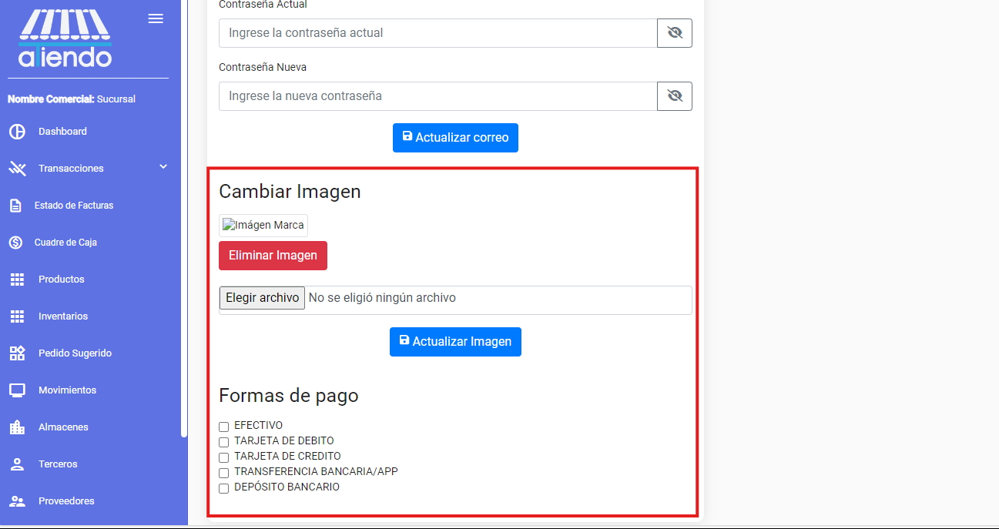
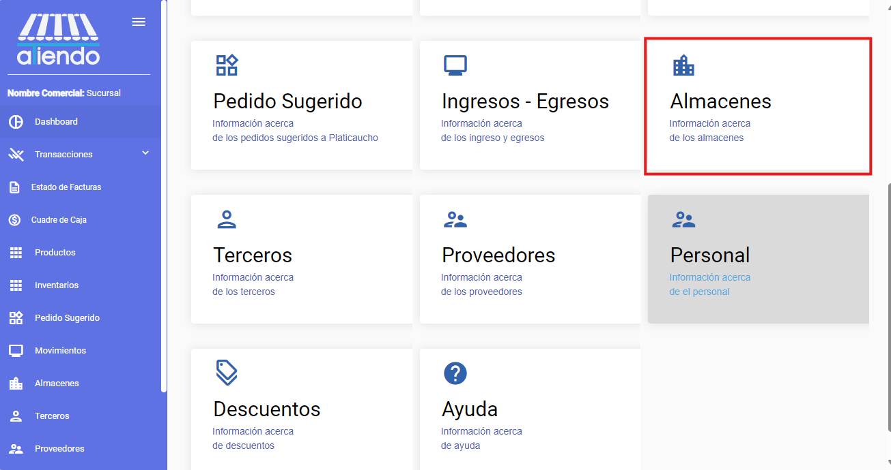

import { Steps } from 'nextra/components'
import { Callout } from 'nextra/components'

# **CONFIGURACIÓN INICIAL**

Para comenzar a utilizar el sistema, es necesario configurar los datos básicos de la empresa. Para ello, se debe ingresar a la sección de configuración y completar los datos solicitados. Es importante tener en cuenta que los datos ingresados en esta sección son necesarios para el correcto funcionamiento del sistema. Debe seguir los siguientes pasos para configurar la empresa:

<Callout type="warning" >
    Antes de comenzar a utilizar el sistema, es necesario configurar los datos básicos de la empresa. Para ello, se deben seguir los siguientes pasos.
</Callout>

<Steps>
### Credenciales de acceso
 
Solicite las credenciales de acceso al administrador del sistema e ingrese al sistema con el usuario y contraseña proporcionados.

 
### Ingresar a la sección de perfil

Una vez dentro del sistema, debe ingresar a la sección de configuración. Para ello, seleccione el menú de configuración ubicado en la parte superior derecha de la pantalla.

### Ingresar la razón social de la empresa

Ingrese la razón social de la empresa en el campo correspondiente y guarde los cambios.

### Ingresar a la sección de configuración

Ingrese a la sección de configuración y seleccione la opción de configuración.

### Subir el certificado de la firma electrónica

En esta sección, debe subir el certificado de la firma electrónica. Para ello, seleccione el botón de subir certificado y elija el archivo correspondiente. Posteriormente, ingrese la contraseña del certificado y guarde los cambios.

<Callout type="warning" >
 El certificado debe tener una extensión .p12 o .pfx
</Callout>

### Correo para envío de facturas

En la misma sección de configuración, debe ingresar el correo electrónico desde el cual se enviarán las facturas electrónicas. Para ello, ingrese el correo y la contraseña en el campo correspondiente y guarde los cambios.

### Logo de la empresa y formas de pago

En la misma sección de configuración, debe subir el logo de la empresa y seleccionar las formas de pago que se aceptarán en la empresa.

### Crear almacenes

En el dashboard, ingrese a la sección de almacenes y seleccione la opción de nuevo para crear un nuevo almacén. Ingrese el nombre del almacén y guarde los cambios.

Ingrese la información del almacén y guarde los cambios.

### Crear un proveedor, comprar productos en el nuevo almacén y vender productos

Una vez creado el almacén, debe crear un proveedor, comprar productos en el nuevo almacén y vender productos. Para ello, siga los pasos indicados en la sección de proveedores, compras y ventas.

</Steps>
