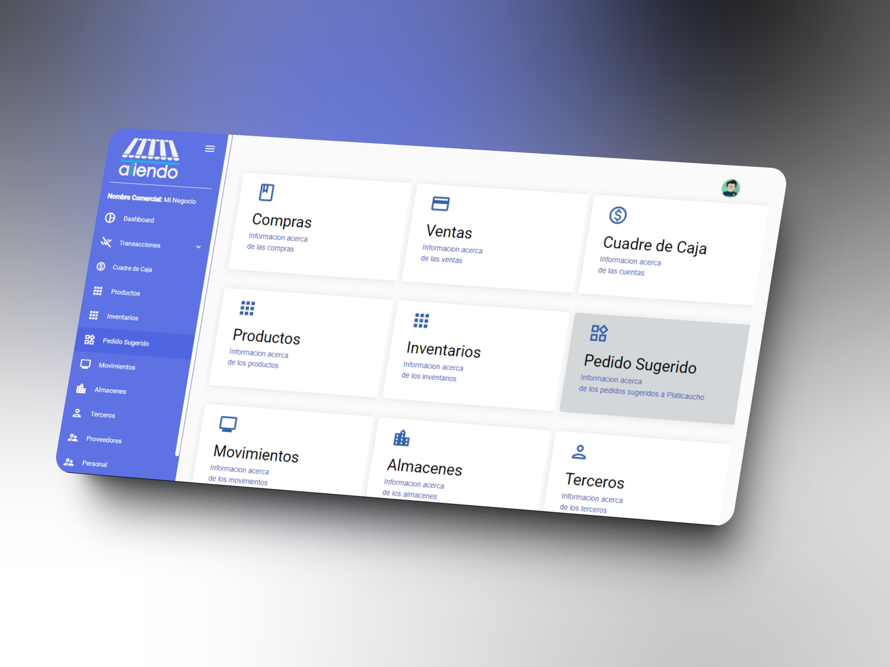

# **Introducción a la Plataforma ATIENDO**

Bienvenido al sistema de facturación. Este manual le guiará a través de las diferentes funcionalidades y módulos del sistema, proporcionándole la información necesaria para utilizar cada uno de ellos de manera efectiva. A continuación, se describen los módulos disponibles:

## Módulos del Sistema

### Compras
**Información acerca de las compras.**
Este módulo le permite gestionar todas las actividades relacionadas con las compras de productos o servicios. Aquí puede registrar nuevas compras, consultar el historial de compras y manejar las devoluciones de productos.

### Ventas
**Información acerca de las ventas.**
El módulo de ventas le proporciona las herramientas necesarias para gestionar sus ventas de manera eficiente. Puede registrar ventas nuevas, generar facturas y consultar el historial de ventas.

### Estado de Facturas
**Información acerca del estado de la aprobación de las ventas.**
El módulo de Estado de Facturas permite supervisar y gestionar el proceso de aprobación de las facturas generadas dentro del sistema. Podrá revisar el estado de aprobación de las facturas, enviar las facturas por correo y volver a enviarlas para una autorización si hubo problemas externos con el SRI.

### Cuadre de Caja
**Información acerca de las cuentas.**
Este módulo está diseñado para ayudarle a cuadrar la caja, registrando todas las transacciones financieras y asegurando que los registros coincidan con el efectivo disponible.

### Productos
**Información acerca de los productos.**
En el módulo de productos, puede gestionar su inventario de productos. Esto incluye agregar nuevos productos, actualizar la información de productos existentes y consultar el stock disponible.

### Inventarios
**Información acerca de los inventarios.**
Este módulo le permite llevar un control detallado de su inventario. Puede realizar ajustes de inventario, registrar entradas y salidas, y generar informes de inventario.

### Pedido Sugerido
**Información acerca de los pedidos sugeridos a Plasticaucho.**
En este módulo, el sistema le sugiere pedidos basados en las necesidades de inventario y las tendencias de ventas. Esta funcionalidad le ayuda a mantener niveles óptimos de stock.

### Movimientos
**Información acerca de los movimientos.**
El módulo de movimientos le permite registrar y consultar todos los movimientos de productos dentro del sistema, incluyendo transferencias entre almacenes y ajustes de inventario.

### Almacenes
**Información acerca de los almacenes.**
Este módulo le ofrece la posibilidad de gestionar sus diferentes almacenes. Puede agregar nuevos almacenes, actualizar información y consultar el estado de cada uno.

### Terceros
**Información acerca de los terceros.**
En el módulo de terceros, puede gestionar la información de sus clientes, proveedores y otros terceros con los que interactúa. Esto incluye registrar nuevos terceros y actualizar la información de los existentes.

### Proveedores
**Información acerca de los proveedores.**
Este módulo está dedicado a la gestión de proveedores. Puede registrar nuevos proveedores, actualizar sus datos y consultar el historial de transacciones con cada proveedor.

### Personal
**Información acerca del personal.**
En el módulo de personal, puede gestionar la información de sus empleados. Esto incluye registrar nuevos empleados, actualizar información personal y roles dentro del sistema.

### Descuentos
**Aplicar descuentos a sus ventas.**
El módulo de Descuentos le permite gestionar y aplicar descuentos a sus ventas de manera flexible. Puede establecer descuentos porcentuales o fijos en el total de la venta, ajustando así los precios para promociones especiales o negociaciones con clientes.

Esperamos que este manual le sea de gran ayuda para comprender y utilizar todas las funcionalidades de su sistema de facturación de manera efectiva.

