# **Guía para la Realización de una Venta**

¡Bienvenido a la guía para la realización de ventas! Aquí te proporcionaremos un recorrido completo sobre cómo manejar el proceso de ventas desde la selección del almacén hasta la generación y envío de la factura. Esta guía está diseñada para proporcionar una experiencia fluida y eficiente para los usuarios, tanto clientes como personal de ventas.

## **Acceso al Módulo de Ventas**

### **1. Ingresar al Módulo de Ventas**

- **Como Cliente**: Si eres un cliente, primero debes seleccionar el almacén en el que deseas realizar la venta.
   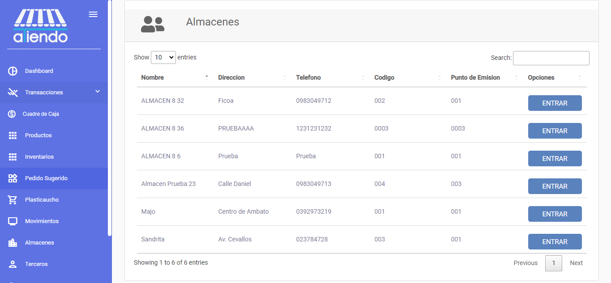

- **Como Personal de Ventas**: Si eres parte del personal de ventas, serás dirigido directamente a la pantalla de ventas principal.
  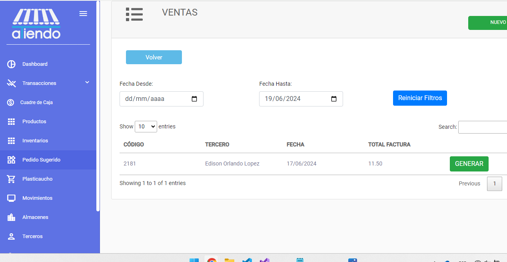

En la pantalla principal de ventas, podrás visualizar las ventas que se han realizado en el almacén seleccionado. También puedes filtrar las ventas por fechas para obtener la información que necesitas.

## **Realización de una Nueva Venta**

### **1. Iniciar una Nueva Venta**

Para realizar una nueva venta, presiona el botón `NUEVO`.

### **2. Selección del Tipo de Venta**

En la nueva pantalla, debes seleccionar si la venta será como **Consumidor Final** o con **Datos de Cliente**. Presiona el botón `Elegir` para continuar.

- **Consumidor Final**: Todos los datos serán generados automáticamente.
- **Cliente**: Se mostrará un formulario para ingresar los datos del cliente.
  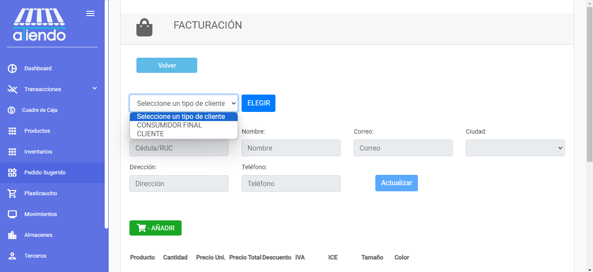

### **3. Ingreso de Datos del Cliente**

- **Cliente Existente**: Si el cliente ya está registrado, puedes buscarlo ingresando su identificación y presionando el botón de `Buscar` (icono de lupa). Los datos se cargarán automáticamente.
  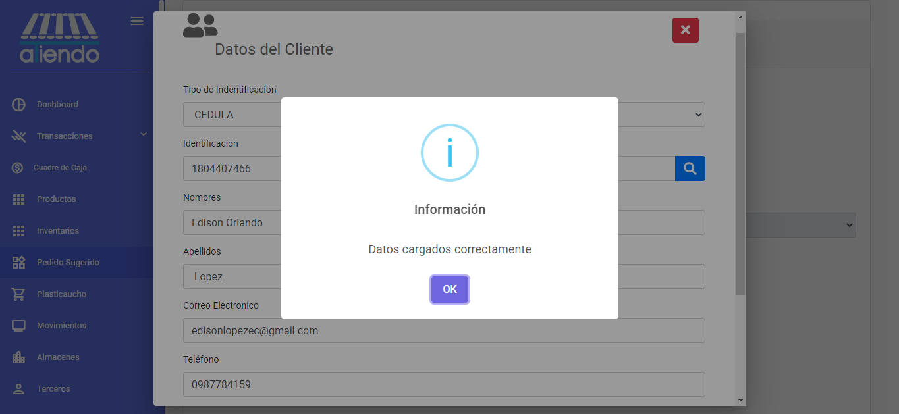

- **Cliente Nuevo**: Si el cliente no está registrado, deberás ingresar todos los datos manualmente.
  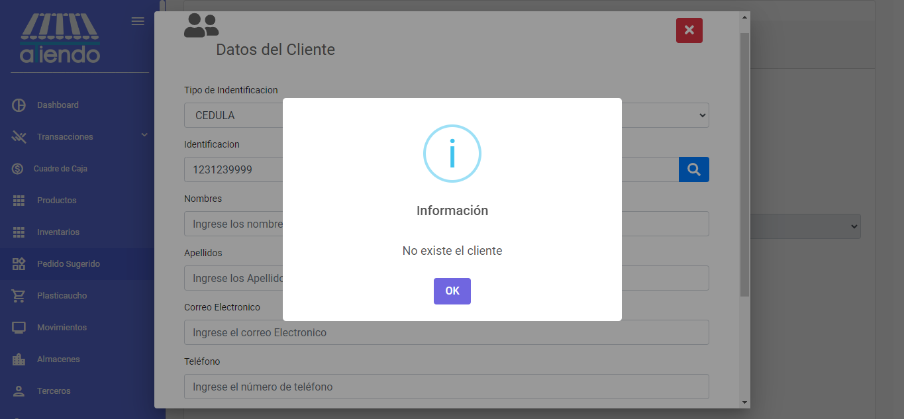

### **4. Adición de Productos a la Factura**

Después de seleccionar el tipo de cliente, puedes añadir productos a la factura. Para cada producto, ingresa la cantidad que deseas añadir a la compra.
  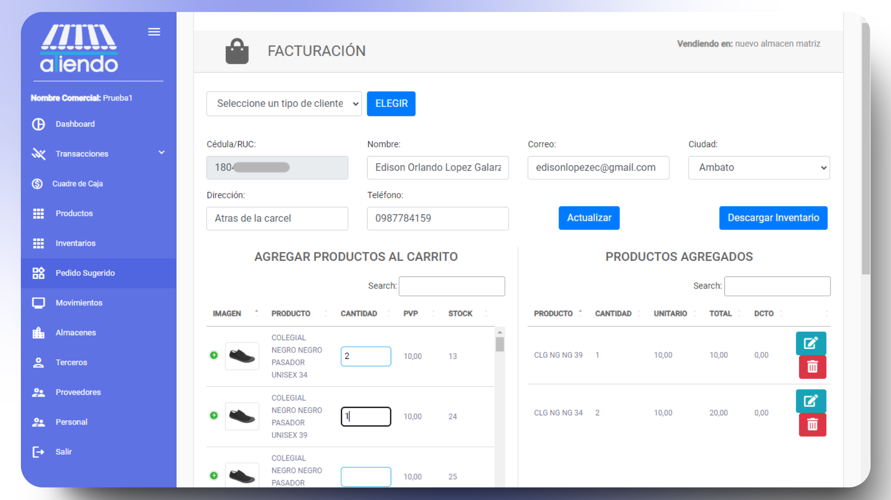

### **5. Edición de Productos**

Una vez agregado el producto, puedes editar aspectos como la cantidad, precio unitario y descuento. El botón de edición cambiará a un icono de check que guardará los cambios.
  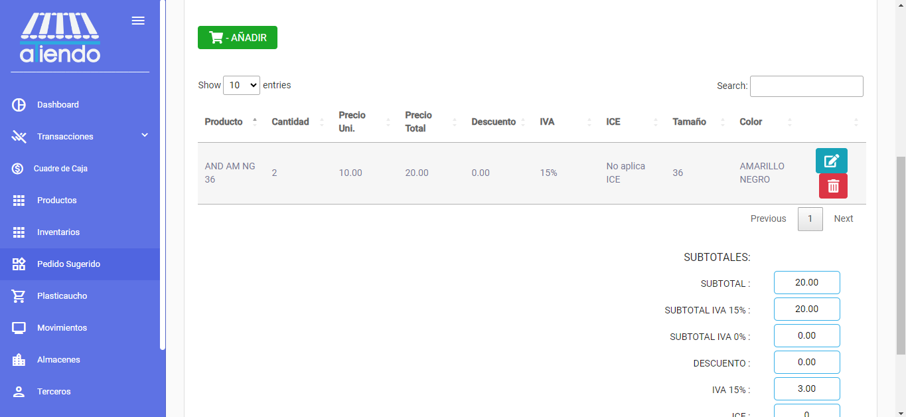
  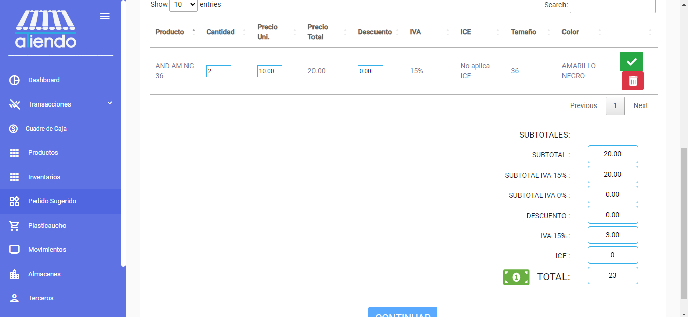

### **6. Revisión de la Factura**

Al presionar `Continuar`, accederás a una nueva pantalla donde puedes visualizar los datos previos a generar la factura.
  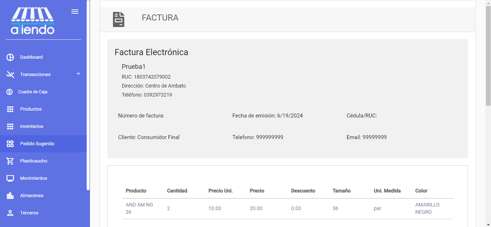

En esta pantalla, también puedes agregar un descuento nominal si es necesario o un descuento porcentual si asi lo requiere.
  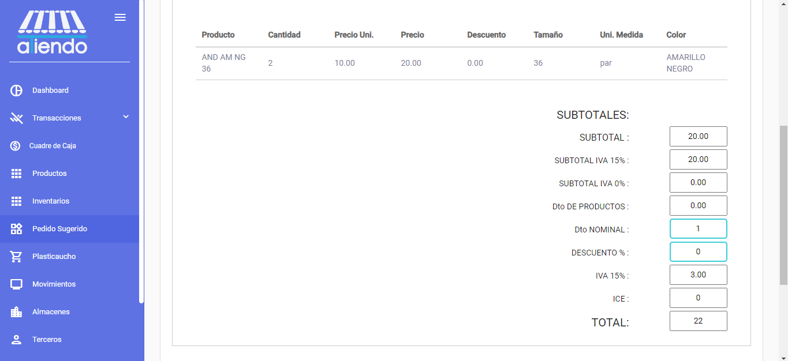

### **7. Abono del Total de la Factura**

Revisa la factura y procede a abonar el total. Puedes utilizar opciones como efectivo, tarjeta de débito o tarjeta de crédito.
  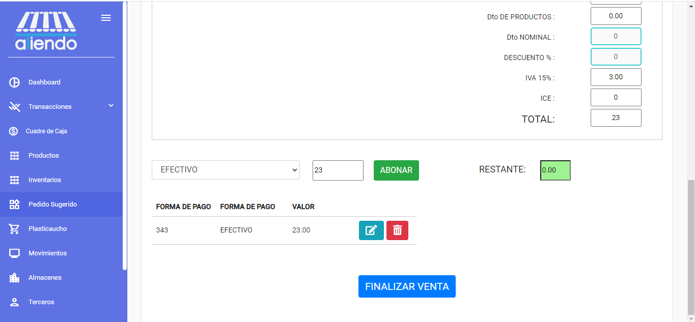
  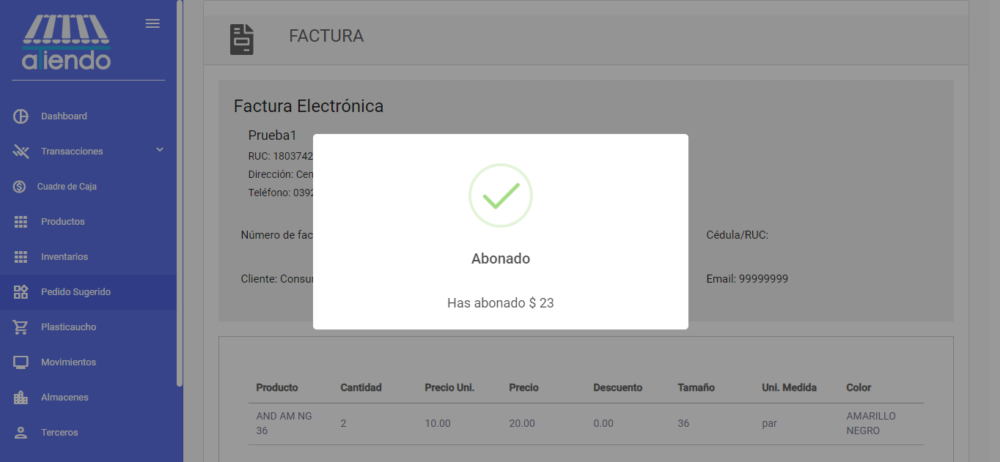

### **8. Finalización de la Venta**

Una vez abonado el total, se habilitará el botón `Finalizar Venta`. Al presionarlo, se generará la factura.
  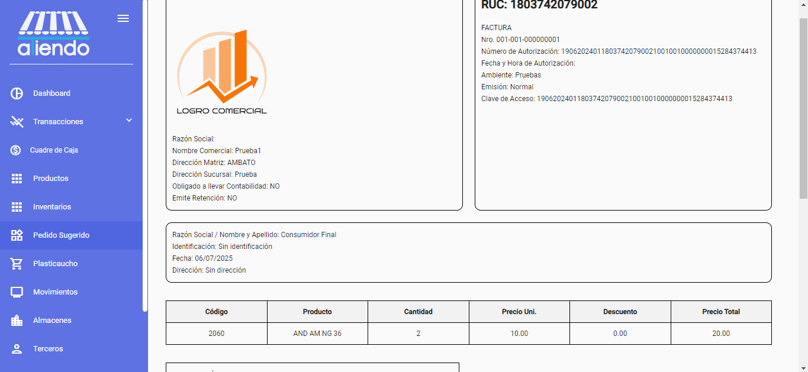

### **9. Envío de la Factura por Correo**

Para enviar la factura por correo, primero debes descargarla a tu máquina utilizando el botón `GENERAR PDF`. Luego, se habilitará el botón `ENVIAR COMPROBANTE POR CORREO` que te permitirá enviar la factura al cliente.

